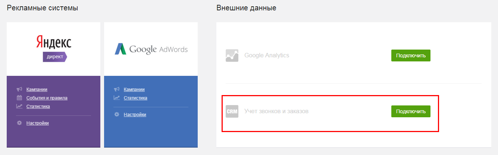

service: optimisator
service_name: K☆50:Оптимизатор
last_modified: 2016-04-10

#Интеграция с Calltracking.ru

Вы можете передавать данные о звонках из Calltracking.ru в К50:Оптимизатор. Они позволят вам проводить более детальный анализ рекламных кампаний с помощью статистики.

##Получение токена доступа

Для подключения Calltracking.ru к К50:Оптимизатору вам необходимо получить идентификатор сайта и токен доступа. Для этого вам необходимо зайти в интерфейс вашего кабинета Calltracking.ru в раздел `Настройки > Интеграции > K50` и скопировать оттуда требуемые параметры.

!!! important "Обратите внимание"
    Интеграция должна быть включена. В противном случае данные не будут поступать в оптимизатор.

##Подключение к Оптимизатору

Подключение к Оптимизатору осуществляется через подключение **Учета звонков и заказов**

При подключении необходимо выбрать Calltracking.ru в качестве типа источника данных и указать идентификатор сайта и токен доступа.

После сохранения настроек начнётся загрузка звонков.