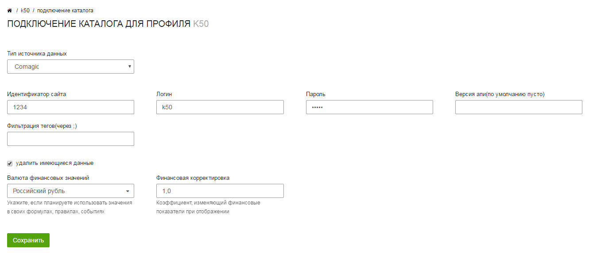

service: optimisator
service_name: K☆50:Оптимизатор
last_modified: 2016-04-10

#Интеграция с Comagic

Вы можете передавать данные о звонках из Comagic в К50:Оптимизатор. Они позволят вам проводить более детальный анализ рекламных кампаний с помощью статистики.

##Получение токена доступа

Для подключения Comagic к К50:Оптимизатору вам необходимо получить идентификатор сайта, а также ввести логин-пароль своего аккаунта. 

##Подключение к Оптимизатору

Подключение к Оптимизатору осуществляется через подключение **Учета звонков и заказов**

При подключении необходимо выбрать Comagic в качестве типа источника данных и указать идентификатор сайта, логин и пароль. Также вы можете исключить звонки с определённых тегов, указав идентификаторы тегов через `;`.

После сохранения настроек начнётся загрузка звонков.

##Параметры полей

Ниже приведены метрики, в которые добавляются данные из Comagic

|Метрика К50 Оптимизатора|Описание|
|------------------------|-------------------|
|CRM: Количество заказов|Количество обращений клиентов. Это сумма всех звонков, заявок и чатов|
|CRM: Цель 1|Звонки|
|CRM: Цель 2|Заявки|
|CRM: Цель 3|Чаты|