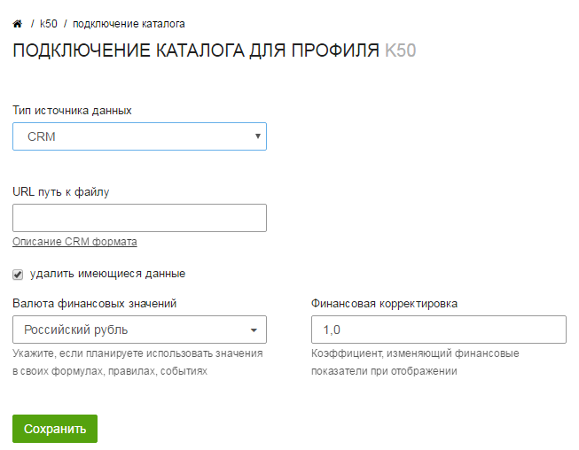

service: optimisator
service_name: K☆50:Оптимизатор
last_modified: 2016-04-10

#Интеграция с произвольной CRM

Вы можете передавать любые данные из произвольной CRM системы в К50:Оптимизатор. Они позволят вам проводить более детальный анализ рекламных кампаний с помощью статистики.

##Составление CSV файла

Для подключения CRM системы к К50:Оптимизатору вам необходимо сгенерировать выгрузку заказов и предоставить нам доступ по ссылке. Выгрузка должна удовлетворять следующим требованиям:

**Формат фида**

Формат файла - `CSV`
Разделитель - `;`
Кодировка - `UTF-8`
Файл должен быть доступен через URL по FTP\WWW протоколам.

**Название заголовков файла**

**Жирным** отмечены обязательные поля

|Заголовок|Описание|
|---------|--------|
|**date**|Дата заказа в формате ГГГГ-ММ-ДД (2014-12-02)|
|**orderId**|Идентификатор заказа в системе crm клиента в формате **integer**|
|**referrer**|Полный реферер посещения|
|**landing**|Страница входа со всеми метками|
|amount|Суммарное количество товаров в заказе|
|margin|Суммарная прибыль(маржа) с заказа|
|revenue|Суммарная стоимость заказа|
|goodsInOrder|Идентификаторы уникальных товаров в заказе через `,`|
|goodsQuantityInOrder|Количество каждого уникального товара в заказе через `,`|
|goodsPriceInOrder|Стоимость каждого уникального товара в заказе через `,`|
|goodsMarginInOrder|Маржа с каждого уникального товара в заказе через `,`|
|trackCode|Идентификатор сеанса в формате **integer**. Используется в случаях, когда с заказом ассоциировано несколько посещений.|
|goal_1|Произвольный параметр в формате **integer**.|
|goal_2|Произвольный параметр в формате **integer**.|
|goal_3|Произвольный параметр в формате **integer**.|
|goal_4|Произвольный параметр в формате **integer**.|
|goal_5|Произвольный параметр в формате **integer**.|

!!! important "Обратите внимание"
    CSV-файл должен обновляться на вашей стороне. При этом, если при обновлении сохраняются уже загруженные в оптимизатор заказы, их идентификаторы не должны изменяться. В противном случае возможно задваивание заказов при импорте.

##Подключение к Оптимизатору

Подключение к Оптимизатору осуществляется через подключение **Учета звонков и заказов**

При подключении необходимо выбрать CRM в качестве типа источника данных и указать ссылку на файл с данными для импорта.

После сохранения настроек начнётся загрузка данных.

##Подключение CSV файла через Google Drive
Вы можете вручную загрузить CSV файл в оптимизатор с помощью Google Drive.
Для этого вам необходимо:

- Загрузить файл в Google Drive
- Предоставить доступ на просмотр файла по ссылке
- Запомнить идентификатор файла. Его можно найти в URL после `/d/` и до следующего подкаталога. Пример:
https://drive.google.com/file/d/`1B_CoIDTftzX7T0xVcmExR1l3Y0U`/view?usp=sharing

- Сформировать URL с использованием получаенного идентификатора по шаблону:
https://drive.google.com/uc?export=download&confirm=no_antivirus&id=`идентификаторCSVфайла`&authuser=0

