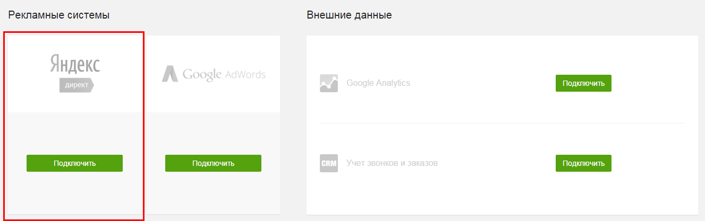
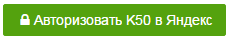
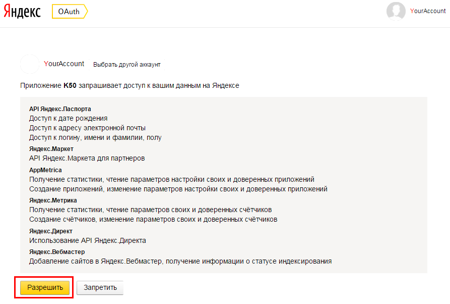
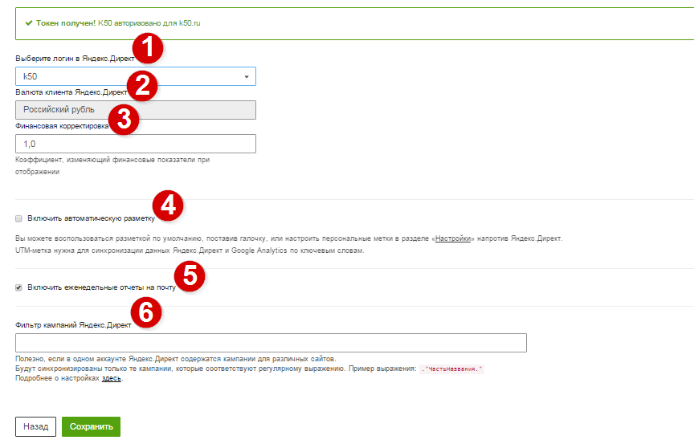
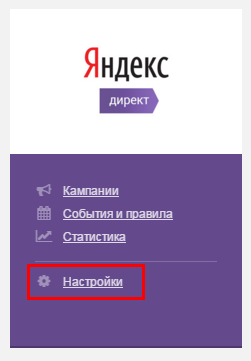
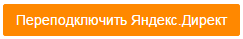
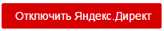

service: optimisator
service_name: K☆50:Оптимизатор
last_modified: 2016-03-09

#Подключение Яндекс.Директа

Для работы с рекламной системой **Яндекс.Директ** необходимо подключить рекламный аккаунт к оптизиматору К50. Подключение к системе осуществляется через виджет на главной странице клиента. Для начала подключения **Яндекс.Директа** к вашему проекту нажмите **Подключить**

##Авторизация

В первую очередь, необходимо пройти процесс авторизации в яндексе. Данная процедура позволит К50 работать с данными вашего рекламного аккаунта.

!!! important "Обратите внимание"
    Перед началом данной процедуры вам необходимо авторизоваться в Яндекс.Директе под логином, к которому вы хотите предоставить доступ.

Для начала процесса авторизации следует нажать на кнопку 

Появится всплывающее окно следующего вида:

Вам необходимо разрешить доступ К50 к данным Директа, в противном случае процедура подключения будет прервана.

##Настройки подключения

После прохождения авторизации вы будете перемещены в окно с настройками подключения следующего вида.

Обратите внимание на параметры в настройках

**
1

Логин Яндекс.Директ
**

Логин аккаунта, который вы собираетесь подключать к К50. Для клиентского аккаунта назначается автоматически. При подключении через агентский аккаунт Яндекса вам будет предложено выбрать логин.

**
2

Валюта клиента Яндекс.Директ
**

Тип валюты, используемый подключенным аккаунтом в Яндексе. Назначается автоматически.

**
3

Финансовая корректировка
**

Коэффициент, на который следует домножать все валютные показатели во время работы со статистикой. Данный коэффициент полезен, когда вы хотите в стоимость закладывать дополнительные издержки (например, НДС)

**
4

Автоматическая разметка
**

Включает разметку ссылок utm-метками для работы с К50. По умолчанию используется стандартный шаблон переметки, который может быть настроен после подключения Директа.

!!! important "Обратите внимание"
    Если вы активировали переметку, после сохранения настроек подключения все объявления в подключенных кампаниях будут перемечены согласно шаблону переметки.
    Поэтому перед включением переметчика убедитесь, что настроенный шаблон переметки вам подходит.

**
5

Еженедельные отчеты на почту
**

Данная опция активирует отправку на почту еженедельных отчетов по кампаниям, подключенным к К50. Отчет позволяет отслеживать динамику показателей по каждой кампании и быстро находить проблемные зоны в аккаунте.

**
6

Фильтр кампаний
**

Вы можете подключить только **часть** кампаний из вашего аккаунта. Для этого вам необходимо указать фильтр, которому должны удовлетворять **названия кампаний** для подключения.
Фильтр представляет собой регулярное выражение, которое проверяет названия кампаний в аккаунте.
Так, фильтр `.*Казахстан.*` будет включать в себя все кампании, содержащие в названии слово `Казахстан`
Фильтру `.*Казахстан.*|.*Беларусь.*` будут удовлетворять кампании, содержащие в названии или `Казахстан`, или `Беларусь`.
Наконец, фильтр `.*[Кк]азахстан.*` импортирует кампании, содержащие в названии либо `Казахстан`, либо `казахстан`

!!! important "Обратите внимание"
    Фильтр чувстивтелен к регистру. `.*Казахстан.*` и `.*казахстан.*` - разные фильтры.

##Скачивание данных

После сохранения настроек, запустится процедура синхронизации данных в кампании и скачивании статистики.
По умолчанию система скачивает данные за последние 90 дней. Период скачивания можно изменить в основных настройках клиента.

!!! important "Обратите внимание"
    Процедура скачивания статистики занимает некоторое время, которое зависит от размеров рекламного аккаунта

После заверешения скачивания вы сможете пользоваться статистикой Директа в К50. В дальнейшем, К50 будет обновлять данные в начале суток.

!!! important "Обратите внимание"
    К50 не скачивает статистику за текущий день. Это значит, что вам будет доступна статистика Директа до дня, предшествующего текущему дню.

##Переподключение аккаунта
Вы можете повторно пройти процедуру подключения аккаунта, изменив настройки подключения. Для этого вам необходимо перейти в раздел настройки виджета Директа.

В разделе **Настройки подключения** нажмите на кнопку 

!!! important "Обратите внимание"
    После изменения настроек подключения все загруженные данные будут удалены и запустится процедура скачивания новых данных.

##Отключение аккаунта
Вы можете отключить ваш аккаунт от управления в К50. Для этого вам необходимо перейти в раздел настройки виджета директа.
В разделе **Настройки подключения** нажмите на кнопку 

!!! important "Обратите внимание"
    После отключения аккаунта будут удалены все загруженные данные системы и отключены все процедуры, автоматически работающие с данными Директа (правила, переметка и пр.).
