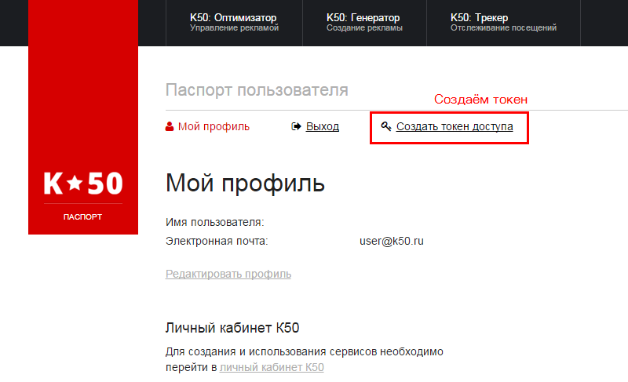
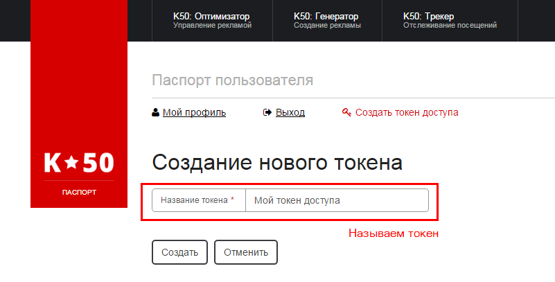
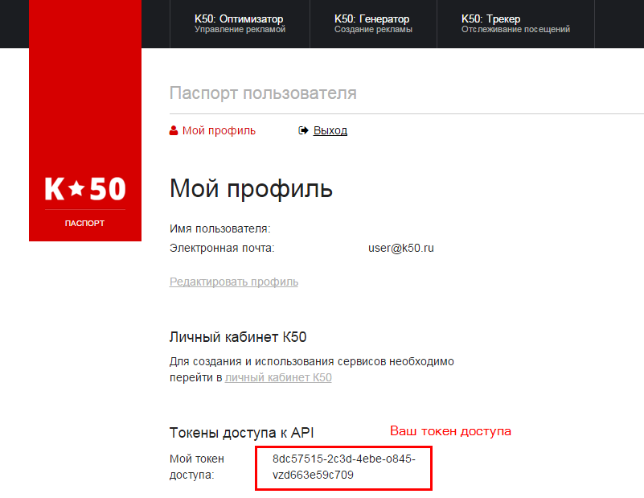

service: tracker-api
service_name: API K☆50:Трекера
last_modified: 2016-03-09

##Получение авторизационного токена

Перед началом работы с API Трекера необходимо создать токен доступа - персональный идентификатор, через который будет осуществляться доступ к программному интерфейсу.

### Создание токена

Токен создается в <a href="https://passport.k50.ru" target="_blank">passport.k50.ru</a>. Для создания токена перейдите по ссылке **Создать токен доступа**

В процессе создания токена вам будет предложено дать ему название. На текущий момент данная процедура не несёт практической пользы, но может быть востребована в дальнейшем.  

После создания, токен всегда будет доступен в <a href="https://passport.k50.ru" target="_blank">passport.k50.ru</a> в разделе **Токены доступа API**

### Пример токена доступа

> 8dc57515-2c3d-4ebe-o845-vzd663e59c709