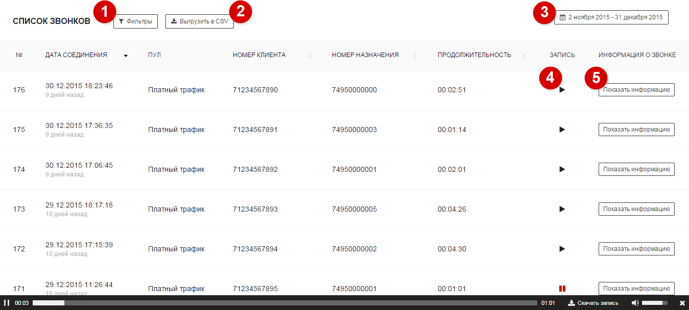
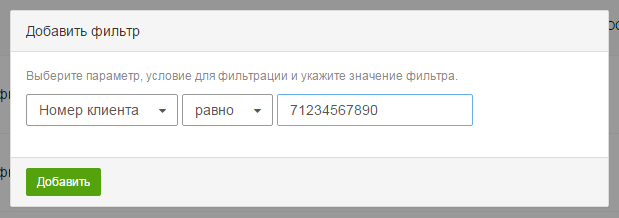
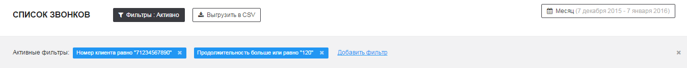
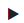
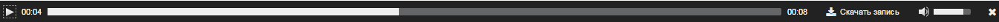
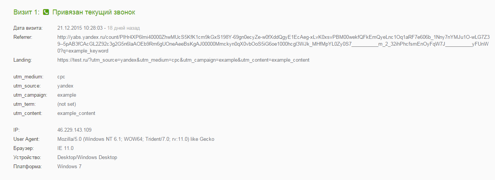
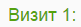
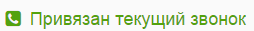

service: tracker
service_name: K☆50:Трекер
last_modified: 2016-03-09

#Список звонков

Список звонков предоставляет подробную информацию по каждому звонку с указанием даты звонка, его длительности и номеров телефона, с которых осуществлялся звонок. Для каждого звонка предоставляется последовательность посещений пользователя до этого звонка. Отчет строится за определенный период времени. По умолчанию он соответствует месяцу.

##Настройка отчета

Ниже описаны инструменты, с помощью которых вы можете настроить вид отчета:

##
1

Фильтры

Фильтры позволяют работать со звонками, удовлетворяющими определенным условиям.
Условия могут применяться на все параметры звонка (номер клиента, длительность звонка и пр.), а также на параметры ассоциированного со звонком посещения (страница входа, реферер и пр.).

Используемые фильтры отображаются в отдельной панели, из которой их можно оперативно убрать.

##
2

Выгрузка CSV

Позволяет выгружать отчет в формате CSV.
В выгрузке будут предоставлены данные:
- по всем параметрам звонка (номер клиента, длительность звонка и пр.)
- по параметрам ассоциированного со звонком посещения (страница входа, реферер и пр.)
- за выбранный период
- с учетом активных фильтров.

##
3

Период отчета

Вы можете выбрать календарный период времени, за который будет построен отчет. По умолчанию отображаются данные за месяц. Доступны стандартные диапазоны дат, также можно выбрать собственный диапазон.

##Сортировка звонков
Вы можете сортировать звонки по основным параметрам (дата соединения, номер клиента, номер назначения и продолжительность). Для этого необходимо кликнуть по названию параметра.

##
4

Запись разговора

Вы можете прослушать запись звонка, нажав на кнопку  напротив этого звонка. Во время прослушивания Вам будет доступна панель плеера, которая позволит управлять настройками воспроизведения, а также скачать запись.

##
5

Подробная информация о звонке

Каждому звонку соответствует цепочка посещений сайта позвонившего пользователя. Количество посещений в цепочке и набор параметров посещения могут отличаться в зависимости от типа ротации номеров (статическая или динамическая) и паттернов поведения пользователя.

Рассмотрим посещение из цепочки:

**Порядковы номер посещения** 
Каждое посещение имеет свой порядковый номер в цепочке. Порядковый номер отображается вверху информации о посещении (например, )

**Ассоциированные со звонком посещения** 
Ассоциированные посещения - посещения, в рамках которых пользователю был показан номер телефона, на который он позвонил в течение времени резерва номера(т.е. можем однозначно сопоставить звонок с посещением). Информация о таких посещениях (источники трафика, браузеры, устройства и пр.) ассоциируется с текущим звонком и будет использоваться далее в остальных отчетах.
Такие посещения имеют следующий ярлык:

**Параметры посещения** 
Каждое посещение может иметь следующие параметры

|Параметр|Описание|
|-----------|--------|
|Дата визита|Дата текущего посещения|
|Referrer|Реферер посещения|
|Landing|Страница входа|
|utm_medium|Метка utm_medium, взятая из Landing (для динамической ротации) либо указанная в качестве метки по умолчанию (для статической ротации)|
|utm_source|Метка utm_source, взятая из Landing (для динамической ротации) либо указанная в качестве метки по умолчанию (для статической ротации)|
|utm_campaign|Метка utm_campaign, взятая из Landing (для динамической ротации) либо указанная в качестве метки по умолчанию (для статической ротации)|
|utm_term|Метка utm_term, взятая из Landing (для динамической ротации) либо указанная в качестве метки по умолчанию (для статической ротации)|
|utm_content|Метка utm_content, взятая из Landing (для динамической ротации) либо указанная в качестве метки по умолчанию (для статической ротации)|
|IP|IP-адрес пользователя, с которого осуществлялось посещение|
|User Agent|User Agent устройства, с которого осуществлялось посещение|
|Браузер|Браузер пользователя|
|Устройство|Устройство пользователя|
|Платформа|Операционая система, установленная на устройстве|
