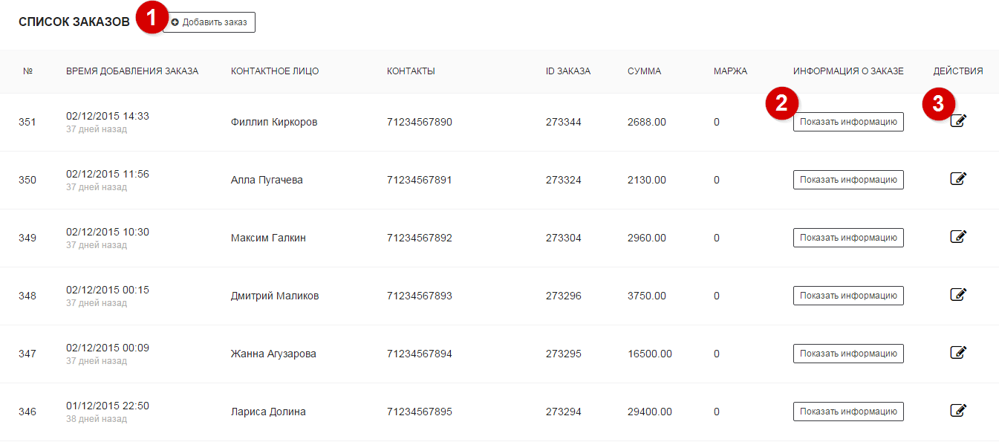
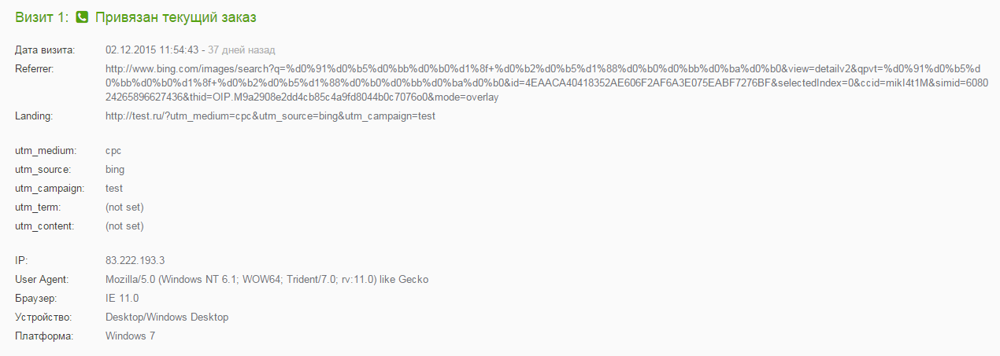
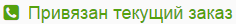
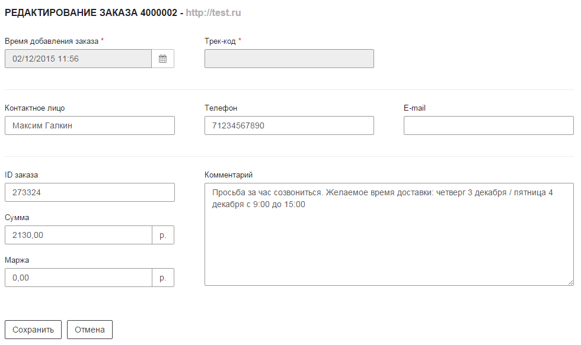

service: tracker
service_name: K☆50:Трекер
last_modified: 2016-03-09

#Список заказов

Список заказов предоставляет подробную информацию по каждому заказу, импортированному из CRM либо созданного в трекере (см. кодовый трекер). Для каждого заказа предоставляется последовательность посещений пользователя до этого заказа. Отчет строится за определенный период времени. По умолчанию он соответствует месяцу.

##Настройка отчета

Ниже описаны инструменты, с помощью которых вы можете настроить вид отчета:

##
1

Добавление заказа

Данный функционал предназначен для пользователей кодового трекера. В момент обращения пользователя следует спросить у него код заявки, отображаемый на сайте.
Далее при добавлении заказа следует указать данный код, чтобы трекер ассоциировал заказ с посещением.

**Параметры заказа** 
В этом разделе приведены параметры, которые можно указать при добавлении заказа. **Жирным** обозначены обязательные параметры.

|Параметр|Описание|
|-----------|--------|
|**Время добавления заказа**|Дата текущего посещения. Добавляется автоматически, можно изменить на собственную|
|**Трек-код**|Код заказа, выданный пользователю на сайте. Его необходимо спрашивать во время обращения пользователя (нужен для кодового трекинга)|
|Контактное лицо|Имя клиента|
|Телефон|Номер телефона контактного лица|
|Email|Email контактного лица|
|ID заказа|Идентификатор заказа|
|Сумма|Доход с текущего заказа|
|Маржа|Маржинальность с текущего заказа|
|Комментарий|Комментарии к заказу|

##
2

Подробная информация о посещениях

Каждому заказу соответствует цепочка посещений сайта позвонившего пользователя. Количество посещений в цепочке и набор параметров посещения могут отличаться в зависимости от паттернов поведения пользователя.

Рассмотрим посещение из цепочки:

**Порядковы номер посещения** 
Каждое посещение имеет свой порядковый номер в цепочке. Порядковый номер отображается вверху информации о посещении (например, )

**Ассоциированные с заказом посещения** 
Ассоциированные с заказом посещения - посещения, которые можем однозначно сопоставить с заказом. Информация о таких посещениях (источники трафика, браузеры, устройства и пр.) ассоциируется с текущим заказом и будет использоваться далее в остальных отчетах.
Такие посещения имеют следующий ярлык:

**Параметры посещения** 
Каждое посещение может иметь следующие параметры

|Параметр|Описание|
|-----------|--------|
|Дата визита|Дата текущего посещения|
|Referrer|Реферер посещения|
|Landing|Страница входа|
|utm_medium|Метка utm_medium, взятая из Landing (для offline заказов) либо метка utm_medium звонка, сконвертированного в заказ (для online заказов)|
|utm_source|Метка utm_source, взятая из Landing (для offline заказов) либо метка utm_source звонка, сконвертированного в заказ (для online заказов)|
|utm_campaign|Метка utm_campaign, взятая из Landing (для offline заказов) либо метка utm_campaign звонка, сконвертированного в заказ (для online заказов)|
|utm_term|Метка utm_term, взятая из Landing (для offline заказов) либо метка utm_term звонка, сконвертированного в заказ (для online заказов)|
|utm_content|Метка utm_content, взятая из Landing (для offline заказов) либо метка utm_content звонка, сконвертированного в заказ (для online заказов)|
|IP|IP-адрес пользователя, с которого осуществлялось посещение|
|User Agent|User Agent устройства, с которого осуществлялось посещение|
|Браузер|Браузер пользователя|
|Устройство|Устройство пользователя|
|Платформа|Операционая система, установленная на устройстве|

##
3

Детали заказа

В каждом заказе можно указать дополнительную инфомарцию. Данную инфомарцию можно просмтреть в разделе деталей заказа и отредактировать при необходимости (редактировать можно все поля, кроме даты и трек-кода). Параметры заказы идентичны параметрам, указанным в разделе **добавление заказа**

